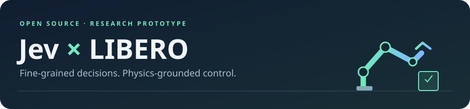
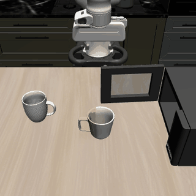
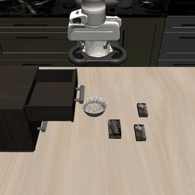
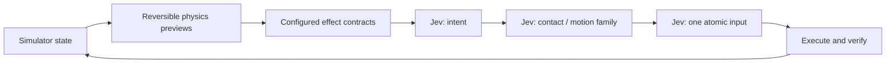

<div align="center">



**A small, inspectable robot-control stack: Jev selects. Physics previews ground the choices.**

[](https://github.com/Dimweaker/jev-libero/actions/workflows/tests.yml)
[](pyproject.toml)
[](LICENSE)
[](#scope--limitations)

[Demos](#demos) · [Quick start](#quick-start) · [How it works](#how-it-works) · [Results](#recorded-results) · [Task configs](docs/tasks.md) · [简体中文](README.zh-CN.md)

</div>

## Demos

<table>
<tr><th align="center">Close the microwave</th><th align="center">Close the top drawer</th></tr>
<tr>
<td align="center"><a href="docs/media/microwave.mp4"></a></td>
<td align="center"><a href="docs/media/top-drawer.mp4"></a></td>
</tr>
<tr><td align="center">14 decisions · 111 environment steps<br/><a href="docs/media/microwave.mp4">MP4</a> · <a href="examples/records/microwave_seed1">Full record</a></td><td align="center">20 decisions · 155 environment steps<br/><a href="docs/media/top-drawer.mp4">MP4</a> · <a href="examples/records/top_drawer_seed1">Full record</a></td></tr>
</table>

These are **recorded simulation trajectories**, not animation generated from a plan. Both satisfy LIBERO's original success predicates. Media plays in **simulation time**, excluding inference and physics-preview waiting; this is not a real-time controller. The drawer demo uses the same engine with a different JSON task configuration—not a hand-written drawer skill.

## Why this project?

- **Atomic control, not task macros.** 27 inputs: Cartesian translations, wrist rotations, open, close, and hold.
- **Real conditional decisions.** Jev chooses an intent, then a contact/motion family, then one input. Later decisions receive earlier choices.
- **Physics-grounded candidates.** Reversible simulator branches measure actual short-term effects. Independent collision-shape distance queries avoid misleading proximity features.
- **Tasks are data.** Object bindings, progress formulas, contact rules, local-goal conditions, prompts, and preview scoring live in JSON.
- **Evidence included.** Compressed requests, responses, predictions, controls, simulator states, costs, and a failed run—not just the best GIF.

## Quick start

### 1 · Install the core

```bash
git clone https://github.com/Dimweaker/jev-libero.git
cd jev-libero
python3.10 -m venv .venv
source .venv/bin/activate
python -m pip install --upgrade pip
pip install -e .

jev-libero tasks
jev-libero inspect examples/records/top_drawer_seed1
```

Inspection needs **no API key, LIBERO installation, or simulator**.

### 2 · Add the simulator

The tested platform is Linux x86-64 / Python 3.10. Keep the pinned robot stack for recorded-state replay.

```bash
# CPU PyTorch is sufficient; install it first to avoid unnecessary CUDA wheels.
pip install torch==2.2.0 --index-url https://download.pytorch.org/whl/cpu
pip install -e '.[robot]'

git clone https://github.com/Lifelong-Robot-Learning/LIBERO.git ../LIBERO
git -C ../LIBERO checkout 8f1084e3132a39270c3a13ebe37270a43ece2a01
export LIBERO_ROOT="$(cd ../LIBERO && pwd)"
export MUJOCO_GL=egl
```

A working EGL setup is needed for off-screen rendering. `--no-render` disables camera output for new runs. See [setup and troubleshooting](docs/setup.md) for CPU-only rendering and dependency details. **Demonstration datasets are not required** for these simulation tasks; the checkout supplies task definitions, assets, and initial states. No edits to LIBERO or `~/.libero` are needed.

### 3 · Replay first—no model calls

```bash
jev-libero replay examples/records/top_drawer_seed1
```

This replays the recorded low-level controls and checks state agreement and task outcome. It is **not** a new Jev rollout.

### 4 · Run a new Jev episode

Provide an [OpenRouter](https://openrouter.ai/) key with access to `typesafe/jev-1.13` and the Decisions API. For example, use an existing private key file:

```bash
export OPENROUTER_API_KEY_FILE=/path/to/private/openrouter.key
# Alternatively, set OPENROUTER_API_KEY in your environment.

jev-libero run --task microwave --seed 1 --init-state 0 \
  --out runs/microwave-s1 --max-decisions 100 --budget-usd 0.10

jev-libero run --task top_drawer --seed 1 --init-state 0 \
  --out runs/drawer-s1 --max-decisions 100 --budget-usd 0.10
```

`run` makes **paid API calls**. The cost guard checks reported spend before each request; it is not a provider-enforced billing cap. Output directories must be new. Never commit credentials or blindly publish local run folders.

## How it works



Each input is previewed for up to **8 environment steps / 0.4 simulation seconds** from a complete physics/controller snapshot. The code filters candidates by predicted effects and configured contact constraints.

When no one-step candidate qualifies, the default two-step mode searches for a local repositioning witness. **Only the first input can execute.** The next input is chosen again after observing the new state; a witness is never an automatically executed skill.

| Responsibility | Owner |
|---|---|
| Collision geometry, physical rollouts, candidate eligibility | Code + FCL + MuJoCo |
| Intent, contact/motion family, executed primitive selection | Jev, within the offered candidates |
| Cartesian feedback, state restoration, original task-success check | Code + LIBERO / robosuite |

This is a **hybrid model-based control prototype**, not a claim that Jev independently discovers the physics or plans an entire manipulation task. Singleton candidate sets also occur and do not demonstrate meaningful choice.

## Recorded results

| Task | Seed | Outcome | Decisions | Env steps | Recorded API cost |
|---|---:|:---:|---:|---:|---:|
| Microwave | 1 | ✅ | 14 | 111 | $0.001249 |
| Microwave | 2 | ❌ | 75 | 600 | $0.005854 |
| Microwave | 3 | ✅ | 53 | 417 | $0.004187 |
| Top drawer | 1 | ✅ | 20 | 155 | $0.001418 |

All use saved initial-state index **0**. Simulator seeds can still change static object placement; they do not control remote Jev randomness. These are **small-sample checks, not benchmark-wide success rates**. API costs exclude computation.

The failed microwave run stops at about **28.33°**: no candidate satisfies the current one-/two-step effect conditions. Some recovery motions need temporary regression that these rules do not represent. The failure remains in the repository.

The published controls reproduce their recorded states and outcomes in the tested stack. Packaging regression tests also preserve **all 311 recorded model requests and choices**. See [results and reproducibility](docs/results.md).

## Task configurations

```bash
jev-libero validate-task top_drawer
jev-libero run --task path/to/my-task.json --out runs/custom --seed 1
```

Start from [`microwave.json`](src/jev_libero/tasks/microwave.json) or [`top_drawer.json`](src/jev_libero/tasks/top_drawer.json). A task configuration specifies *what effects count*, not a predetermined action sequence. Formulas use a small declarative expression language—no `eval` or embedded Python. [Configuration guide →](docs/tasks.md)

## Scope & limitations

- Uses **privileged simulator state** and an exact local simulator, not image-only perception or a learned world model.
- Not validated on physical robots; sampled gripper-contact checks are **not** continuous-time or whole-arm safety guarantees.
- One active target and a short preview horizon. General pick-and-place, multi-object planning, and switch/light state mutation are not implemented.
- Accurate state prediction does not prove every derived feature or task contract is correct. Geometry regressions are tested separately.
- Simulation pauses during decisions. Physics previews dominate latency; the drawer episode took about **131 seconds wall time** for **7.75 seconds simulated motion**.
- The live API and third-party simulator interfaces can evolve. The recorded examples remain useful without API access.

## Development

```bash
pip install -e '.[dev]'
ruff check src tests tools
ruff format --check src tests tools
pytest                          # core tests, no simulator or API
pytest --simulation             # optional offline physics tests; requires robot extra + LIBERO_ROOT
```

No test makes an OpenRouter call. The optional suite includes full control replay, false-zero-distance regressions, snapshot restoration, two-step witness checks, and the new runner driven by recorded responses.

```text
src/jev_libero/      # client, policy, world, geometry, recorder/CLI
  tasks/            # declarative task definitions
examples/records/   # compact, auditable outcomes and trajectories
tests/              # CPU tests + optional simulation regression
docs/               # setup, configuration, results, demo media
```

[Contributing](CONTRIBUTING.md) · [Third-party acknowledgements](THIRD_PARTY.md) · [MIT License](LICENSE)

Built on [LIBERO](https://github.com/Lifelong-Robot-Learning/LIBERO), [robosuite](https://github.com/ARISE-Initiative/robosuite), [MuJoCo](https://github.com/google-deepmind/mujoco), [python-fcl](https://github.com/BerkeleyAutomation/python-fcl), and [Jev via OpenRouter](https://openrouter.ai/typesafe/jev-1.13). Physics-grounded decision interfaces were inspired in part by [Typesafe Mario](https://github.com/fhshaik/typesafe-mario).
