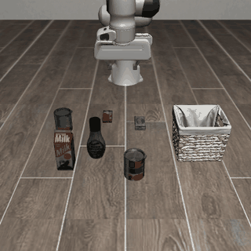

<div align="center">


**用 Jev、物理前视和可配置任务探索机器人控制。**

[**打开交互展示页：视频与 Jev 决策同步回放 ↗**](https://dimweaker.github.io/jev-libero/)

[English](README.md) · [任务配置](docs/tasks.md) · [结果与复现](docs/results.md) · [MIT](LICENSE)

</div>

## 演示

<table>
<tr><th>关闭微波炉</th><th>关闭顶层抽屉</th></tr>
<tr><td><a href="docs/media/microwave.mp4"></a></td><td><a href="docs/media/top-drawer.mp4"></a></td></tr>
<tr><td>14 次原子决策 · 111 环境步</td><td>20 次原子决策 · 155 环境步</td></tr>
<tr><th colspan="2">抓起 alphabet soup 并下放到篮子中</th></tr>
<tr><td colspan="2" align="center"><a href="docs/media/alphabet-soup.mp4"></a><br/>40 次原子决策 · 314 环境步<br/><a href="docs/media/alphabet-soup.mp4">MP4</a> · <a href="examples/records/alphabet_soup_seed1">完整记录</a></td></tr>
</table>

三个 LIBERO 任务配置共用同一控制引擎。视频按仿真时间播放，省略决策和物理前视的等待。

[**打开交互回放，跟随视频查看 Jev 的选择与概率 ↗**](https://dimweaker.github.io/jev-libero/)

## 功能

- **精细控制**：27 个输入，涵盖平移、旋转、开爪、合爪和保持。
- **分层决策**：Jev 依次选择意图、接触/运动方式和具体输入，每层选择传递给下一层。
- **物理前视**：在可恢复的仿真分支中预测候选动作的效果。
- **任务配置**：通过统一接口，由 JSON 选择测量项、输出字段、接触规则、目标及各层 Jev 接收的内容。
- **运行记录**：保存模型请求、预测、控制指令、仿真状态、费用与轨迹媒体。

## 快速开始

### 1 · 安装

使用 Python 3.10 或 3.11，按自己的习惯准备环境：

```bash
git clone https://github.com/Dimweaker/jev-libero.git
cd jev-libero
pip install -e .

jev-libero tasks
jev-libero inspect examples/records/top_drawer_seed1
```

核心包可以浏览任务和已有记录。运行机器人任务时，再接入 LIBERO。

### 2 · 接入 LIBERO

如果已有兼容的 LIBERO / robosuite / MuJoCo 环境，可以沿用现有仿真依赖，补充几何库并指定 LIBERO 路径：

```bash
pip install python-fcl scipy
export LIBERO_ROOT=/path/to/LIBERO
export MUJOCO_GL=egl
```

<details>
<summary>从零安装？可以参考演示使用的环境</summary>

```bash
pip install torch==2.2.0 --index-url https://download.pytorch.org/whl/cpu
pip install -e '.[robot]'

git clone https://github.com/Lifelong-Robot-Learning/LIBERO.git ../LIBERO
git -C ../LIBERO checkout 8f1084e3132a39270c3a13ebe37270a43ece2a01
export LIBERO_ROOT="$(cd ../LIBERO && pwd)"
export MUJOCO_GL=egl
```

这套依赖对应仓库中的演示记录。CPU 版 PyTorch 即可；任务定义、场景资源和初态由 LIBERO 提供。

</details>

离屏渲染使用 EGL；添加 `--no-render` 可以只保存控制与状态。其他依赖和渲染选项见 [安装文档](docs/setup.md)。

### 3 · 选择 API 并运行

**TypeSafe 官方 API**：[获取密钥](https://console.typesafe.ai/settings/keys) · [官方文档](https://docs.typesafe.ai/introduction/quickstart)

```bash
export TYPESAFE_API_KEY_FILE=/path/to/private/typesafe.key
# 也可设置环境变量 TYPESAFE_API_KEY。

jev-libero run --provider typesafe --task top_drawer --seed 1 \
  --out runs/drawer-s1 --max-decisions 100 --budget-usd 0.10
```

**OpenRouter**：[获取密钥](https://openrouter.ai/)

```bash
export OPENROUTER_API_KEY_FILE=/path/to/private/openrouter.key
# 也可设置环境变量 OPENROUTER_API_KEY。

jev-libero run --provider openrouter --task microwave --seed 1 \
  --out runs/microwave-s1 --max-decisions 100 --budget-usd 0.10
```

两种入口共用控制流程。官方 API 使用 `/v1/systemone` 和 `jev-latest`；OpenRouter 使用 `typesafe/jev-1.13`，也是 CLI 的默认入口。

每轮使用新的输出目录。`--max-decisions` 限制决策次数，`--budget-usd` 设置客户端费用保护。运行会调用付费 API：OpenRouter 返回费用，TypeSafe 按 token 用量估算费用。[接入与计费说明 →](docs/setup.md#official-api)

## 配置自己的任务

可以从内置任务开始修改，也可以直接传入自己的 JSON：

```bash
cp src/jev_libero/tasks/top_drawer.json my-task.json
# 修改任务绑定、目标、测量指标和提示。
jev-libero validate-task my-task.json
jev-libero run --provider typesafe --task my-task.json --out runs/custom
```

[`microwave.json`](src/jev_libero/tasks/microwave.json)、[`top_drawer.json`](src/jev_libero/tasks/top_drawer.json) 和 [`alphabet_soup.json`](src/jev_libero/tasks/alphabet_soup.json) 使用同一测量接口。`measurements` 选择计算项，`features` 选择输出字段，`policy` 选择各层 Jev 接收的内容，`record_features` 选择逐步记录的字段，无需任务专用执行分支。详见 [配置指南](docs/tasks.md)。

运行抓取任务：

```bash
jev-libero run --provider typesafe --task alphabet_soup --seed 1 \
  --out runs/soup-s1 --max-decisions 60 --budget-usd 0.03
```

## 工作方式

**读取仿真状态 → 物理前视 → 按任务条件筛选 → Jev 分层选择 → 执行并观察**

每个候选输入最多前视 **8 个环境步，即 0.4 秒仿真时间**。MuJoCo 计算动力学，FCL 测量碰撞形状间的距离，任务配置定义期望效果。

Jev 从候选中选择动作。需要先调整位置时，两步前视会寻找通向目标效果的局部路径；控制器执行一个选中的输入，观察新状态，再作下一次选择。

[架构与实现细节 →](docs/architecture.md)

## 已记录结果

每个内置任务展示一个通过 LIBERO 原始判定的记录：

|任务|种子|结果|原子决策|环境步|API 费用|
|---|---:|---|---:|---:|---:|
|微波炉|1|成功|14|111|$0.001249|
|顶层抽屉|1|成功|20|155|$0.001418|
|Alphabet soup|1|成功|40|314|约 $0.003023|

均使用初态索引 0。微波炉与抽屉使用 OpenRouter；抓取使用 TypeSafe，费用按输入 token 单价估算。表中仅计模型调用费用。[运行记录与分析 →](docs/results.md)

### 回放已有轨迹

如果想查看已有轨迹，可以使用上面的参考环境运行：

```bash
jev-libero replay examples/records/top_drawer_seed1
```

回放会执行保存的控制指令，检查状态和任务结果，无需调用 API。[环境参考](docs/setup.md#tested-simulation-stack) 列出了生成这些记录时使用的版本。

## 开发

```bash
pip install -e '.[dev]'
ruff check src tests tools
ruff format --check src tests tools
pytest
pytest --simulation  # 配置 LIBERO 后可选的物理检查
```

测试使用模拟或已记录的 API 响应。仿真测试覆盖控制回放、几何测量、快照恢复和两步前视。

[展示页开发说明](site/README.md) 包含静态构建和浏览器检查方法。

想报告问题或提交代码改进？查看 [贡献指南](CONTRIBUTING.md)。

[第三方致谢](THIRD_PARTY.md) · [MIT License](LICENSE)
